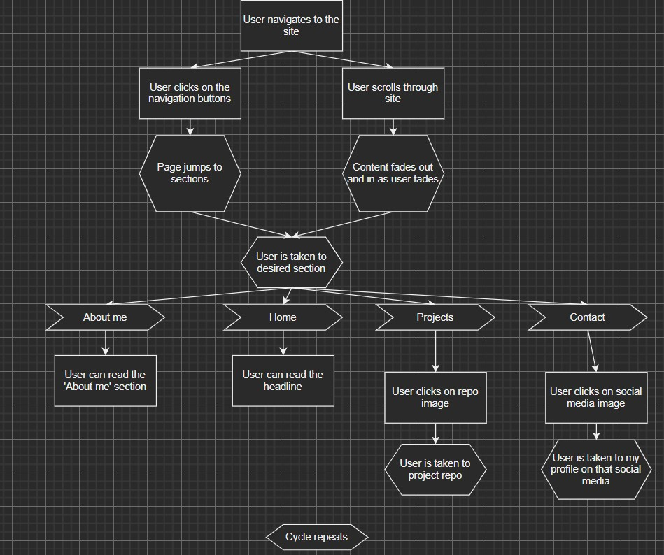
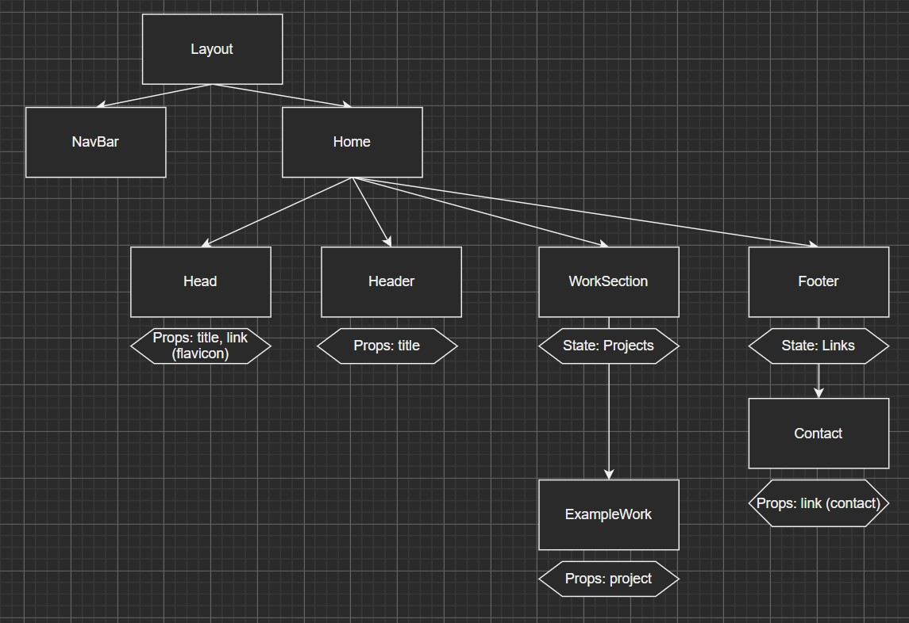
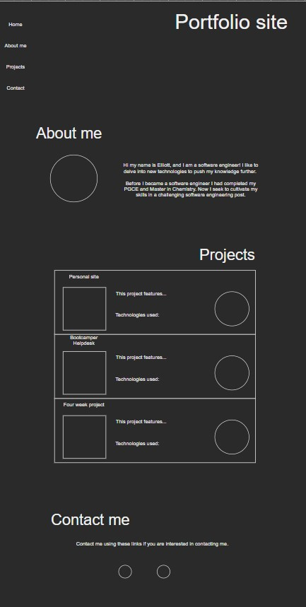

# Project: Portfolio site

**URL for currently deployed site**

> [Site link](https://esportfoliosite.netlify.app/)

## What I learnt
This has been a quite an ambition project for the timescale I attempted to impliment it in. Having just over the last week introduced to TypeScript I wanted to complete this project using both TypeScript and Next.js. While this project does not benefit from some of Next.js features (I.e. getStaticProps/paths, APIs (to which I got some practice trialling and erroring these),  I did get to grips with creating my custom 404 page, using CI/CD, integrating TypeScript, using SCSS and global/module SCSS.

I had wanted to use more of Next.js' features, including building a backend to serve the data. I also attempted to integrate express and PG to complete this task but felt that this was potentially more than was needed and making the solution much more complex than actually required. 

The styling of this project was beyond what I had done previously. Chiefly, integration of 'react-intersection-observer' to make the transitions was extremely satisfying and something I will seek to use again in the future. 

## To do
- Update site as projects are completed

## Getting started

Installing dependencies

> npm i

Starting local environment

> npm start

## Components and file structure

**User story**

**Components**

**Low fidelity wire frame**

