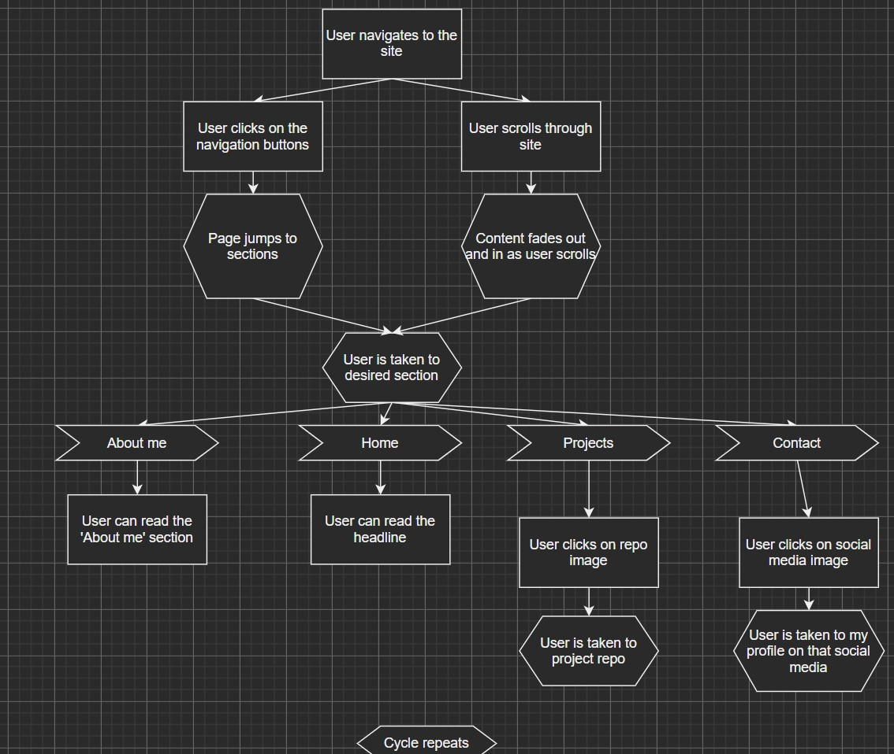

# Project: Portfolio site

## Getting started

Installing dependencies

> npm i

Starting local environment

> npm start

## Components and file structure

**User story**

**Components**

**Low fidelity wire frame**

## Extra information/links

**URL for currently deployed site**

> [Site link](https://sharp-lewin-b674fc.netlify.app/)
